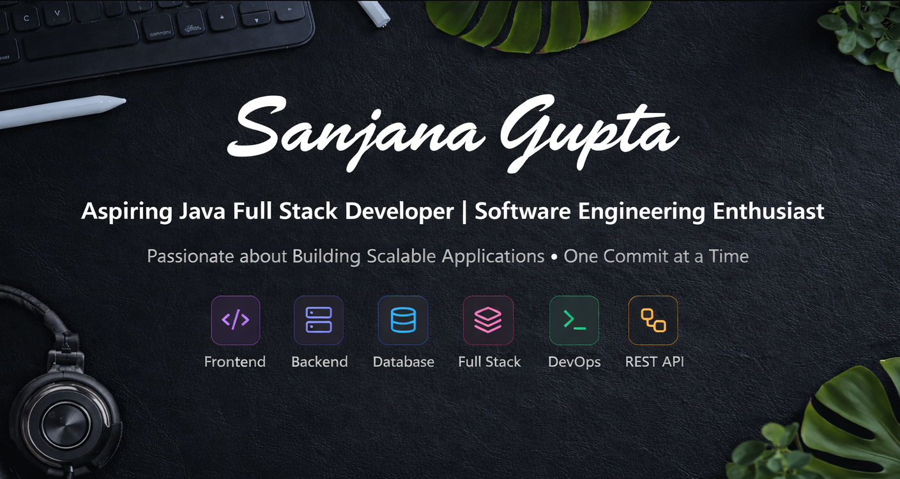

  

<h1 align="center">Hi 👋, I'm Sanjana Gupta</h1>

<table>
<tr>
<td width="50%" valign="top">

## 👩‍💻 About Me

 🎓 Computer Science Student   
 💻 Core Skills: Java | Spring Boot | SQL   
 🌱 Building Full Stack and REST APIs Projects   
 🎯 Goal: Become a professional software developer  

</td>

<td width="50%" valign="top">

## 🛠 Tech Stack

</td>
</tr>
</table>

## 🚀 Projects
🔹 **Student Management System (Java + JDBC)**  
🔹 **REST API using Spring Boot**  
🔹 **MySQL Database Design Project**  
🔹 **Mini Web App (HTML/CSS/JS)**  

---

<h2 align="center">📊 GitHub Stats</h2>

---

<!-- <h2 align="center">📈 Contribution Graph</h2>

<h2 align="center">🐍 Contribution Animation</h2>

--- -->

## 🔗 Connect With Me
 💼 LinkedIn: https://www.linkedin.com/in/sanjana-gupta-8663a12a4/  
 📧 Email: guptaraani627@gmail.com

  ⭐ If you like my work, consider giving a star!

